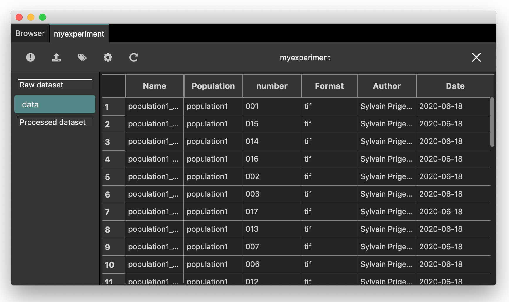

.. _tutorial-experiment:

Tutorial: experiment
====================

In BioImageIT, data are represented using 3 levels:

* **Data**: a single data is made of one or several data files described with metadata. A data can be a ``RawData`` if it comes from an acquisition system or a ``ProcessedData`` if it is a data obtained by processing any other data.

* **DataSet**: a collection of *Data* described with metadata. We define two types of *DataSets*: a ``RawDataSet`` contains a collection of ``RawData``, and a ``ProcessedDataSet`` contains a collection of ``ProcessedData```

* **Experiment**: contains one ``RawDataSet``, the images to be analysed, and a list of ``ProcessedDataSet``, one for each process applied to the Data. The Experiment is described using metadata.

The **BioImageIT browser application** is a desktop graphical interface that allows to manipulate ``Data``, ``Datasets`` and ``Experiments`` with a set of forms.
The more common usage of this application is following this data manipulation steps: 

* Create an Experiment
* Import data to the Experiment
* Tag Data 
* Process data. 

with goings and coming between steps 2 to 4

This first tutorial cover the step 1, 2 and 3.

Open the browser application with the following command or click the shortcut icon:

.. code:: shell
    
    python3 browserapp.py

The browser app
---------------

The main screen of the browser app is shown in the figure below. It looks like a classical file navigator with on 
top the navigation bar with the previous, next, parent, home navigation buttons, the current directory path and 
the add bookmark button. On the left there is a shortcut bar, with the new experiment button and the bookmarked shortcuts.
In the screenshot example bellow, we have only one bookmark that is the userdata directory.
Finally, the main central area is the list of directories and files in the current directory. 
When we browse a classical file system, the browser app is no more no less than a classical file browser. Later in this tutorial,
we will see that when we open an ``Experiment`` we have a dedicated view to experiment navigation.


The tutorial dataset
--------------------

To illustrate the ``Experiment`` management with the browser app we will use a synthetic dataset available at `<https://github.com/bioimageit/bioimageit-notebooks/tree/main/synthetic_data/data>`_
The dataset is made of 40 synthetic images from 2 populations.


Data are spots with a lot of noise, and one population has more spots that the other. In this tutorial, we are going to create 
a new ``Experiment``, import the dataset in the ``Experiment`` and tag the raw data to identify the two populations. 


.. figure::  images/experiment/image2c.png
   :width:   250 
   :align:   center   

Create an experiment
--------------------

To create an new ``Experiment``, click on the **New Experiment** button on the left bar of the browser app.


It opens a new window with a form asking the needed information:

* Destination: the directory where the ``Experiment`` will be create. In the example we selected the default *userdata* folder in the BioImageIT prepackaged install.
* Experiment name: the name we give to the experiment
* Author: the name of the person that created the experiment. It can be several people.

When we click on the create button, a new directory is created in the *destination* folder with the experiment metadata.
A popup window says that the ``Experiment`` has been created. Click *Ok*, and the ``Experiment`` navigation window should show:


The ``Experiment`` navigation window is made of three main elements. 

1- The navigation bar allows to operate on the experiment metadata. Available tools are:

* *Information*: the information tool button allows to edit the ``Experiment`` main metadata.
* *Import data*: the import data tool button shows a popup window with forms to import single data or a corpus of data from a directory.
* *Tag data*: the tag data tool button shows a popup window with forms to add tags to raw data
* *Process data*: the process data tool button opens the tool finder app to start processing the data
* *Refresh*: the refresh tool button allows to reload the ``Experiment`` metadata.

2- The left bar contains the list of all the datasets. By now, we only have one empty dataset called ``data``. This is the ``RawDataSet`` that is automatically created.

3- The central are contains the list of the data in the selected dataset

Import data
-----------

To import data, we click on the *Import data* tool button on the ``experiment`` toolbar


The popup window has two tabs. On to import a *Single Data* file, and one to import *Multiple Data*. In this tutorial, we have all the 
raw data in a folder. Thus we click the import *Multiple Data* tab. The form has the following inputs:

* *Folder*: the directory where the data to import are
* *Recursive*: if checked, the data from all subdirectories will be imported
* *Filter*: add a condition on the to import. In this example, we select all the file with a name ending by *.tif*
* *Copy data*: if true, the data are copied in the ``RawData`` folder of the experiment. otherwise, the ``Experiment`` will only keep the **absolute** path of the data. 
* *Format*: a metadata information about the data format
* *Author*: a metadata information about who created the data
* *Created date*: a metadata information about when the data have been created.

Click *import*. When the data are imported a popup window inform that the import is done. Click *ok*. The ``RawDataSet`` automatically
updates and now we have the list of the ``RawData``.


Tag data
--------

As we saw at the beginning of this tutorial, the imported data are from 2 populations. We now want to tag the ``RawData`` to identify them.
Click on the *Tag data* tool button.


The tag data popup window contains 3 tabs:

* *Tags*: contains a form to manually declare new tags to the ``Experiment``. This is useful only when we want to manually tag all the data
* *Tag using separator*: contains a tool to automatically extract tags from the ``RawData`` file names using separator strings.
* *Tag using names*: contains a tool to automatically extract tags from the ``RawData`` by searching specific words in the file names.

In the sample data we use for this tutorial, the file names contains the words *population1* and *population2*. Thus, we will 
use the *Tag using names* tool. The *Tag using names* tool form has 2 inputs:

* *Tag*: the name we want to give to the tag. In our example, we use *Population*
* *Search names*: the words we want to extract from the file names. In out example, we want to extract *population1* and *population2* 

click *Validate*, and a new column with the extracted tag is now visible in the ``RawDataSet`` data list view:


In our sample data, the file names also contains a number located between two *_*. We propose now to extract this number as a tag for each 
data. We click on the *Tag data* tool button and select the tab *Tag using separator*.


We fill the form as follow:

* *Tag*: the name we want to give the tag. Here we chose *number*
* *Separator*: the chars that is used as separator in the filename. In our example it is *_*
* *Position*: The position of the word we want extract with respect to *Separator*. In our example we set 1 because we want the word that is just after the first *_* in the file name. 

Click *Validate*, and a new column with the extracted tag is now visible in the ``RawDataSet`` data list view:




Edit metadata
-------------

When we click on any ``RawData`` on the data table, a bar become visible on the right side of the window. It contains a form with all
the metadata and the tags of the selected ``RadData``.
We can then manually edit any of the editable metadata:


Visualize data
-------------- 

When we double click any ``RawData`` on the data table, it opens a data viewer. The viewer is different depending on the data **format**.
The data format is specified in each data metadata. If the browser app does not recognize the format, it cannot open it since it does not have any viewer for this data. 

In our example, the data format are *tif*. Thus, the browser app opens the *Napari* viewer:


Summary
-------

In this tutorial we saw all the functionalities of the browser app interface that are:

* Browse the file system
* Create an experiment
* import data to an experiment
* tag an experiment data
* edit data metadata
* visualize data 

The last button that we did not use it the *Process data* tool button in the ``Experiment`` tool bar. When we click on it, it opens
the tool finder app to start processing data. This is the topic of the next tutorial:


