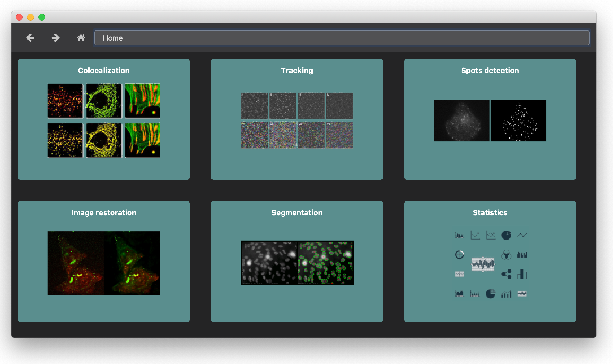
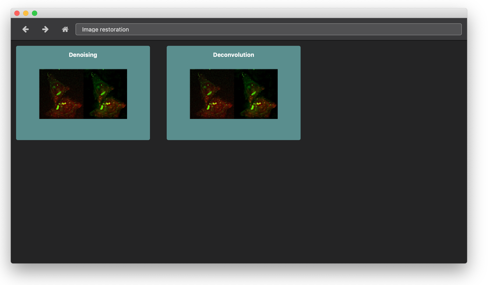
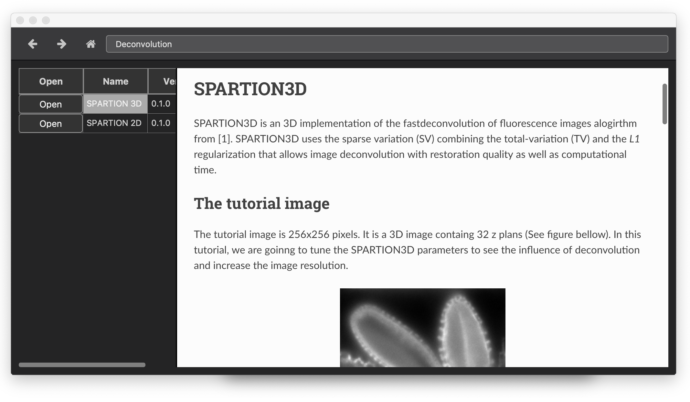
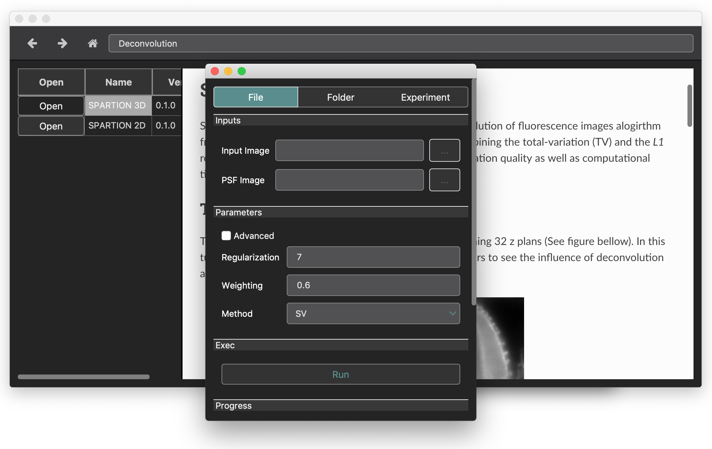

Tutorial: finder
================

In this tutorial, we show the finder application that allows to browse the data processing toolbox. In BioImageIT, processing 
tool are registered into toolboxes that organase them depending on the application.

Open the finder application with the following command or clic the shortcut icon:

.. code:: shell
    
    python3 finderapp.py

The finder app
--------------

The image below shows a screen shot of finder application home screen. It look like a classical browser. The toolbar on the top 
allows to navigate in the toolboxes (previous, next, parent, home) and show the virtual path of the curent toolbox in the 
toolbox three. 

When we clic on a toolbox, it open the toolbox. If the toolbox contains sub applications fields, then we have a new list 
of processing applications. In the figure below, we opened the *image restoration* toolbox that contains two 
sub-toolboxes: *denoising* and *deconvolution*  

When a toolbox has no sub-toolbox, the finder shows the list of the available tools:

As we can see in the figure above, on the left, there is the list of the availabel tools, and on the right the user documentation of 
the selected tool.   

Tools documentation
-------------------

The tool documentation is provided by the author of the method. This documentation is application oriented and illustrated by real
data.

Run a tool
----------

Each tool has an *Open* button. When we clic it, it open the tool runner (see figure below). The tool runner is a graphical interface 
dedicated for each tool to allow any user to process data with the tool. This is the topic of the next tutorial.

