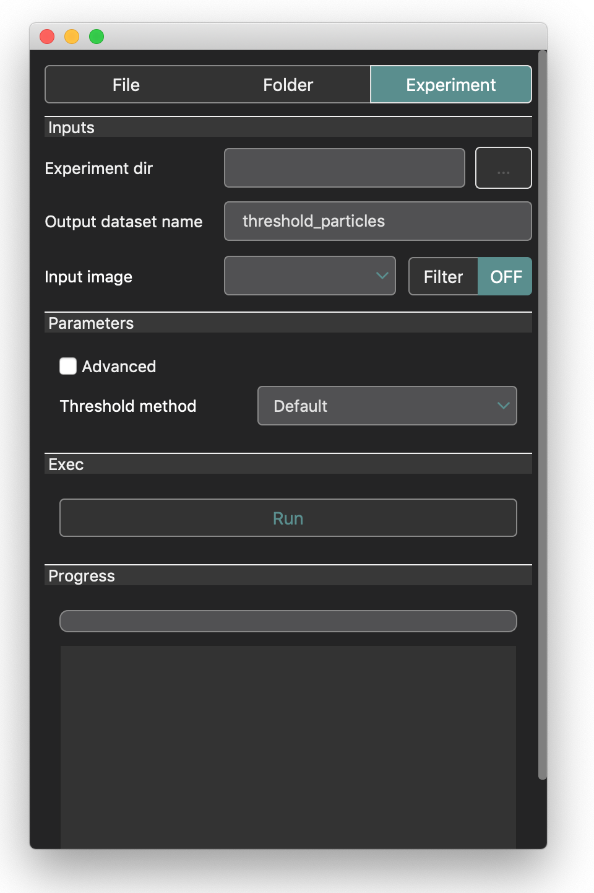

Tutorial: pipeline
==================

In this tutorial, we are going to write a pipeline for batch processing data stored in an ``Experiment``. 
We will use the 3 application *Browser app*, *Finder app* and *Runner app* to manage and process data.

The tutorial project
--------------------

In this tutorial we use the same dataset as in the first tutorial (see :ref:`tutorial-experiment`). We then supposed that we 
already have a created experiment with the imported and taged.

In the following of this tutorial, we are going to process the data in 3 steps.

* Image deconvolution on each image to ease the spot segmentation
* Auto thresholding and particle analysis on the deconvolutes images
* Statistical testing with the wilcoxon test to conclude if the two populations have significantly different number of spots

The 3 proposed steps are just one possible way to analyse the data, to illustrate the use of BioImageApp. Many other processing 
pipeline are possible to analyse this dataset, but it is not the purpose of this tutorial.

First, we open the *Browser* application in the experiment we created in the previous tutorial:

Image deconvolution
-------------------

To make the spot segmentation easier to identify, we chose to preprocess the data with a deconvolution algorithm. The selected 
algorithm is the SPARTION2D. It is a c++ implementation of the sparse variation deconvolution method. 

Clic on the *Process* button in the experiement toolbar:

Then clic on the *Image restoration* toolbox:

And clic on the *Deconvolution* toolbox:

The *Finder app* shows the documentation of the SPARTION2D algorithm. It allows to know to which time of images it is adapted and how to 
tune the parameters.

Clic on the open button of the SPARTION2D tool:

Go to the *experiment* tab and select the *Experiment dir*. Then the *Input Image* box is automatically filled with the list of 
datasets in the Experiment (only the *data* dataset in our example). The *Input Image* field have a *Filter* button to select a subset 
of data in the dataset. In our case, we want to process all the data, thus we do not use it. In the next processing steps we will see 
how to use this *Filter* button:  

Now, we can tune the deconvolution parameters. In the example below, we set the parameters we found in the previous tutorial. Then press *Run*:

When the processing is finished, the progress bar is at 100% and the log area print *done*

We can then close the *Runner app* and go back to the *Browser app*. Clic on the refresh toolbar button:

The new dataset sdeconv2d become accessible:

Double clic on one of the data allows to visualize the processed data and the corresponding automatically generated metadata:

Spot detection
--------------

In this step, we apply an automatique threshold and a particle analysis in each images in order to obtain the number of spots for 
each images. To do that we will use a Fiji macro that runs an auto-threshold and the analyse particles tool. 

Open the *Finder app* using the *Process* button of the experiement browser

.. figure::  images/pipeline/image5a.png
   :align:   center 

Clic on the *Segmentation* toolbox.  

Open the *Count particles* tool:

Clic the *Experiment* tab, and select the *Experiment dir*. For the *Input image* field, select the *sdeconv2d*. This means that 
we will run the spot detection on the images in the *sdeconv2d* dataset: 

For the spot detection parameters, we can select the automatic threshold method. We can recognize that we have all the methods 
from the Fiji software:

Select the "Default" method and press run:

When the processing is finished, close the *Runner app* and the *Finder app*. Clic on the *Refresh* button in the *Browser app*:

We can see that for each input image, we have 3 outputs:

* Particle drawing: an image with the drawing of the extracted spots
* Number of particles: a csv file that contains the number of detected spots in the image
* Particle measures: a csv file containg the measurement table of the spots desciptors (area and position)

When we double clic on the data, it open a viewer:

Statistical testing
-------------------

In the previous processing step, we extracted the number of spots for each images. This number is contained in the 
*Number of particles* csv files. In this step we are going to run a statistical testing on these number in order to 
measure is the *Population1* and *Population2* data have significant different number of spots. 

To illustrate the use of statistical testing with BioImageIT, we chose in this tutorial to run a Wilcoxon rank test. This is not 
the best test for such statistical analysis, but the purpose of the tutorial is to show how to run proceses, and Wilcoxon rank test 
is a simple easy to use example.

Clic on the *Process* button of the Experiment browser:

Clic on the *Statistics* toolbox:

Open the *Wilcoxon* tool:

Select the Experiment in the *Experiment dir* field:

The *Wilcoxon* tool have too inputs: *Population1* and *population2*. These two inputs are in fact arrays of values corresponding 
to the two population we want to process. In most of the existing application, to construct such arrays, we need to write a script that
read the values (number of spot) for each image, create the two arrays and run the statistical test.

Because in BioImageIT, we tag the data, we can simply use *Filter* to automatically generate the data arrays.

For the *Population1* and *Population2*, select the line *threshold_particles:Number Of Particles* (see figure above).

Now, we need to specify that for *Population1* we want to select the images with the corresponding tag. Clic on the *Filter* button 
at the right of the *Population1* input:

It opens a popup window where you can tune a filter. Here we select the data where the tag *Population* equals "population1".
Then, we do the same for the second population:

Press the *Run* button:

Close the *Runner app*, and press *Refresh* on the experiment browser:

We can now see the dataset that correspond to the *Wilcoxon* testing. It contains 2 data: 

* t: the Wilcoxon statistic
* p: the p-value

Double clic on the *p* data to visualize the p-value:

We can see the the p-value=0.0021. This means that reject the null hypothesis saying that the 2 populations have the 
same number of spots.

.. note::
    During the step, we mention that BioImageIT created two arrays from the dataset *threshold_particles:Number Of Particles* using the *Filters* that we tuned with the experiment tags. In fact, these arrays are stored in the output dataset. Thus, if we open the directory ``myexperiment/Wicoxon/`` we can find the file ``x.csv`` and ``y.csv`` that actually contain these two arrays.

Conclusion
----------

In this tutorial we saw how to use the *Browser app*, the *finder app* and the *Runner app* to build step by step a image analysis 
pipeline without writing a single line of code.

All the data we generated are stored in an ``Experiment`` database with automatically generated metadata. This means that for 
every data in the ``Experiment`` database, we can track it origin and the parameters of each processing tool used to genate it.
