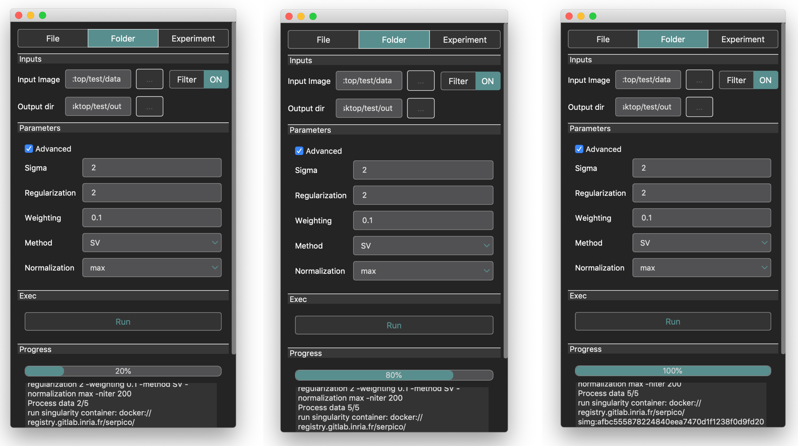

Tutorial: runner
================

In this tutorial, we show step by step how to use the runner application to process data.

The *Runner app* can be openned two ways:

* Using the finder app and clic open on the selected tool
* Using the command line ``python3 runnerapp.py /path/to/the/tool/wrapper/xml``

Application overview
--------------------

When we open the *Runner app* it shows a graphical interface dedicated to the process it runs. Figure below show screen shots 
of the *Runner app* for the SPARTION2D deconvolution algorithm

The *Runner app* contains 3 tabs: *File*, *Folder* and *Experiment*. The *File* tab aims at processing a single data file 
(or N-uplet of file depending on the tool), the *Folder* tab aims at batch processing corpus of data file located in a directory, and 
the *Experiment* tab aims at processing data sets anotated in an ``Experiment`` database. In the next sections we details the use of 
each of the 3 modes.

The *Inputs* section of the graphical interface show forms to select the inputs. Of course, the forms are differents depending on the 
mode (*File*, *Folder* and *Experiment*).

The *Parameters* section of the graphical interface shows a form to tune the processing parameters. These parameters a dedicated to the 
opened processing tools, and the tunning is documented in the tool documentation available through the *Finder app*.

The *Exec* section contains the button to start the processing.

The *Progress* section contains a progress bar and a log text area to see how the processing is going.

Single file processing
----------------------

In this section, we are going to deconvolute a 2D image of spots. The image we use is from the BioImagePy tutorials and is 
available at `<https://gitlab.inria.fr/bioimage-it/bioimagepy-tutorial/-/tree/master/synthetic_data/data>`_  

First, we select the image using the file selector form named *Input Image*. When the image is selected, a *View* button get visible in 
the right of the file selector form. 

When we clic the view button, it open the image viewer:

Let press the *Run* button to try deconvolution on the selected image with the default parameters. When we press 
*Run*, the progress bar indicates the progress and we can see the log informations of the process written all along 
the process. Note that, the first time you run a process, it may take some time to initialize since the software has to download 
the tool and configure the tool.

When the processing has finished, it automatically open the viewer with the processed data

We can see on the figure above that the result is not good. Thus, let tune the parameters. On the *Parameters* section, the 
*Advanced* chackbox allow to show/hide the advanced parameters that can be usefull for fine tunning parameters. Parameters tuning 
is tool dependent. Thus, to tune parameters you need to read the tool documentation (available with the *Finder app*).
Everytime we change the parameters, we need to press *Run* and get the new result:

Note that when using the *File* mode, the *Runner app* does not generate any metadata. This mode aims at providing a convenient 
tool for trail and error parameters tuning. If you need to keep track and record the results and used setting please use the 
*Experiment* mode.

Directory processing
--------------------

The *Folder* mode allows to process data files located in the same directory. First we select the directory we want to process. In this example,
we copy & paste 5 images from the BioImagePy tutorials dataset available at `<https://gitlab.inria.fr/bioimage-it/bioimagepy-tutorial/-/tree/master/synthetic_data/data>`_

On the right of the input selector widget, the is a *Filter* button that is *OFF* by default. When we clic the *Filter* button, a 
popup window shows a form that allows to filter the data we want to process. In our example we select all the files whose name ends 
by ".tif":

When we clic on *Validate*, the filter popup close and the filter status become *ON*:

Select the output directory with the *Output dir* widget:

Change the parameters with the values that we selected in the previous section, and clic *RUN*. The application runs 
the processing tool for all the files:

When the processing is finished, we can find the results in the output directory we gave:

Experiment processing
---------------------

The ``Experiment`` processing is the topic of the next tutorial where we show how to use the Runner app to build a processing 
pipeline for data stored in an ``Experiment``